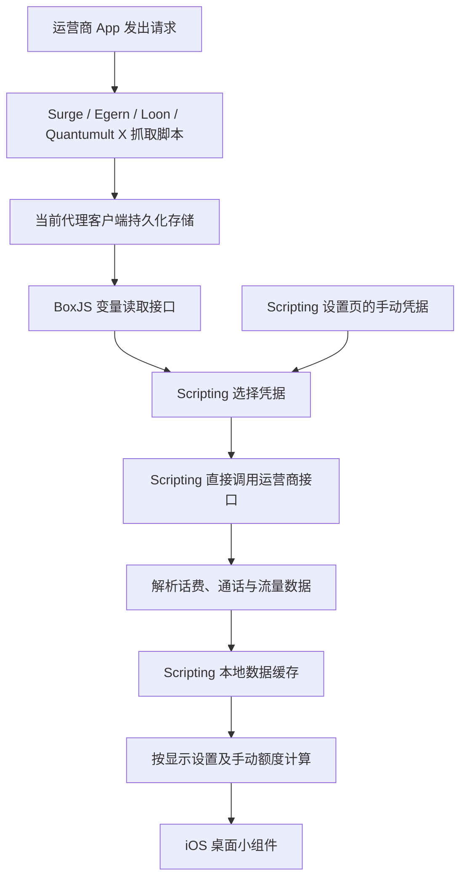

# 中国联通与中国移动 Scripting 小组件

本项目为中国联通和中国移动提供 iOS Scripting 小组件，显示话费、通话、通用流量和定向流量。两套项目均由代理客户端抓取登录凭据，保存到 BoxJS，再由 **Scripting 直接调用运营商接口**、缓存数据并渲染小组件。

支持 Surge、Egern、Loon 和 Quantumult X。两家运营商共用一个 BoxJS 订阅「Zayia 组件服务」，分别保存自己的凭据。Scripting 同时支持 BoxJS 读取和手动填写凭据。

这份 README 同时面向使用者和后续维护 agent。安装可先看「安装资源」；接手开发请重点阅读「查询原理」「开发目录与发布目录」「维护约定」。详细使用说明见 [中国联通安装说明](INSTALL.md) 和 [中国移动说明](Mobile.md)。

## 当前版本与功能

维护基线：2026-10-09。以后以安装包内 `script.json` 和抓取脚本头部版本为准，不要仅依据这张表判断版本。

| 项目 | 中国联通 | 中国移动 |
| --- | --- | --- |
| Scripting 版本 | 1.0.9 | 1.3.2 |
| JS 抓取脚本版本 | 1.0.7 | 2.0.1 |
| Scripting、代理资源、BoxJS 应用名称 | 中国联通 | 中国移动 |
| 抓取来源 | 中国联通 App 首页请求头 | 中国移动 App 登录请求体及请求头 |
| 核心凭据 | `ecs_token`、`ecs_acc` | 手机号、加密登录参数、登录地址、加密标识 |
| Cookie 刷新方式 | 凭据失效后从 App 重新抓取 | Scripting 可自动登录、刷新会话 |
| 查询执行位置 | Scripting | Scripting |
| 完全相同的重复抓取 | 不写入、不通知 | 不写入、不通知 |
| 凭据变化时 | 保存并通知 | 保存；成功通知最多每 10 分钟一次，支持静默模式 |

两个小组件都支持：

- 显示话费、通话、通用流量、定向流量，以及按设置合计的流量。
- 切换剩余量与已用量及其百分比，选择小号、中号等小组件样式。
- 流量统一以 GB 显示，保留两位小数，按 `1 GB = 1024 MB` 换算。
- 无限套餐或没有有效总量时，使用用户填写的通用高速流量额度作为兜底。
- 网络查询、缓存读取和查询失败时的旧数据兜底。

## 安装资源

所有链接来自 [Zayia/NetTool](https://github.com/Zayia/NetTool)。按正在使用的代理客户端选择一套资源即可。

| 资源 | 中国联通 | 中国移动 |
| --- | --- | --- |
| Scripting 安装包 | [中国联通.scripting](https://raw.githubusercontent.com/Zayia/NetTool/main/Scripting/中国联通.scripting) | [中国移动.scripting](https://raw.githubusercontent.com/Zayia/NetTool/main/Scripting/中国移动.scripting) |
| Surge 模块 | [ChinaUnicom.sgmodule](https://raw.githubusercontent.com/Zayia/NetTool/main/surge/ChinaUnicom.sgmodule) | [ChinaMobile.sgmodule](https://raw.githubusercontent.com/Zayia/NetTool/main/surge/ChinaMobile.sgmodule) |
| Egern 模块 | [ChinaUnicom.yaml](https://raw.githubusercontent.com/Zayia/NetTool/main/Egern/ChinaUnicom.yaml) | [ChinaMobile.yaml](https://raw.githubusercontent.com/Zayia/NetTool/main/Egern/ChinaMobile.yaml) |
| Loon 插件 | [ChinaUnicom.lpx](https://raw.githubusercontent.com/Zayia/NetTool/main/Loon/ChinaUnicom.lpx) | [ChinaMobile.lpx](https://raw.githubusercontent.com/Zayia/NetTool/main/Loon/ChinaMobile.lpx) |
| Quantumult X 重写 | [ChinaUnicom.conf](https://raw.githubusercontent.com/Zayia/NetTool/main/QuantumultX/ChinaUnicom.conf) | [ChinaMobile.conf](https://raw.githubusercontent.com/Zayia/NetTool/main/QuantumultX/ChinaMobile.conf) |
| JS 抓取脚本，代理资源自动加载 | [ChinaUnicom.js](https://raw.githubusercontent.com/Zayia/NetTool/main/Scripts/ChinaUnicom.js) | [ChinaMobile.js](https://raw.githubusercontent.com/Zayia/NetTool/main/Scripts/ChinaMobile.js) |

两家共用的 BoxJS 订阅地址：

```text
https://raw.githubusercontent.com/Zayia/NetTool/main/BoxJs/ComponentService.boxjs.json
```

1. 在当前代理客户端中配置 BoxJS，确认浏览器能够访问 BoxJS。
2. 在 BoxJS 添加「Zayia 组件服务」订阅；已有此订阅时更新即可。中国移动还需要在订阅的「中国移动」应用中填写手机号。
3. 安装对应的模块、插件或重写，启用脚本和 MITM，并信任客户端证书。Surge 的导入入口是「配置 → 模块 → 安装新模块」。这些资源不是完整代理配置文件。
4. 中国联通打开 App 首页；中国移动打开 App 登录。抓取结果可在 BoxJS 对应应用中查看。
5. 导入对应的 `.scripting` 安装包。运行脚本打开设置页，在「凭据来源」开启「从 BoxJS 读取凭据」，填写实际可访问的「BoxJS 地址」。点击「完成」保存，再添加或刷新桌面小组件。

代理客户端的持久化存储彼此独立。Scripting 必须访问保存了凭据的那个客户端所提供的 BoxJS。更换客户端时需要在新客户端重新配置、抓取；仅更新同一客户端的资源或订阅不需要重新抓取仍有效的凭据。

## 整体原理



BoxJS 订阅 JSON 定义应用、字段和说明，本身不包含实际账号数据。代理抓取脚本把值写进客户端持久化存储，BoxJS 提供查看、编辑和 `/query/data/...` 读取入口。

Scripting 设置页中的手动凭据保存在 Scripting 自己的 `Storage` 中。它与 BoxJS 变量是两个来源，不能把设置页的 Cookie 当成 BoxJS 变量，也不能把 BoxJS 订阅文件当成运行时凭据文件。

两个代理 JS 都只负责抓取，不主动请求外部服务。查询和中国移动的自动登录发生在 Scripting 内；实际网络连接仍遵循设备当前网络及代理分流配置。

## 中国联通：抓取与查询

### 抓取入口和保存内容

抓取的请求是：

```text
POST https://m.client.10010.com/navigationService/naviService/hotRecommend
```

`hotRecommend` 是 App 请求的接口名称，在本项目中只作为抓取触发点。小组件的话费与套餐数据来自后面的两个查询接口。不要为了修改界面名称而修改这个匹配路径。

`Scripts/ChinaUnicom.js` 仅读取请求头 Cookie：

- 同一次请求必须同时存在 `ecs_token` 和 `ecs_acc`，否则保留已有凭据。
- `login_type` 按抓取值保存，包括 `01`、`06`、`19` 等；空值原样保留，缺失时不补默认值。脚本不根据它筛选手机号登录类型。
- 有有效手机号时，从 `c_mobile` 或 `u_account` 取值，统一保存为 `c_mobile`；有有效 `c_version` 时也保存。
- 不要求或补造 `JSESSIONID`。Cookie 按第一个等号拆分字段，保留值中的 `+`、`/`、`=`，不对令牌做 URL 解码。
- 完全相同的凭据不重复写入或通知。凭据变化时保存并通知，没有中国移动那样的 10 分钟通知冷却。

这是当前已验证的 ECS 凭据方案。`login_type` 不再被抓取器过滤，不代表服务端对所有账号、任意字段组合都保证接受；也不要把其中一个 ECS 字段擅自删除。

### BoxJS 存储位置

| 项目 | 值 |
| --- | --- |
| BoxJS 应用 ID | `ZayiaComponentService.ChinaUnicom` |
| 客户端持久化根键 | `ZayiaComponentService` |
| BoxJS 字段 ID | `@ZayiaComponentService.ChinaUnicom.Settings.Cookie` |
| BoxJS 界面位置 | Zayia 组件服务 → 中国联通 → Cookie |
| Scripting 读取接口 | `<BoxJS 地址>/query/data/ZayiaComponentService` |

读取接口返回的 `val` 可以是 JSON 字符串或对象，Scripting 解析后取 `ChinaUnicom.Settings.Cookie`。存储结构示例仅使用占位符：

```json
{
  "ChinaUnicom": {
    "Settings": {
      "Cookie": "ecs_token=<抓取值>; ecs_acc=<抓取值>; login_type=<抓取原值>"
    }
  }
}
```

写入时保留根对象中的其他应用和设置，不覆盖原作者的 `ComponentService` 根键。

### Scripting 查询

| 用途 | 方法与接口 |
| --- | --- |
| 话费 | `GET https://m.client.10010.com/mobileserviceimportant/home/queryUserInfoSeven` |
| 套餐、通话、流量 | `GET https://m.client.10010.com/servicequerybusiness/operationservice/queryOcsPackageFlowLeftContentRevisedInJune` |

`widget.tsx` 并发请求两个接口，在请求头带上选定 Cookie。话费 URL 由 `shared/utils/unicomAuth.ts` 构造：从 Cookie 取当前手机号和版本；没有手机号时省略号码参数，由服务端识别 ECS 账号。不得恢复原作者的固定手机号。

凭据优先级是：开启 BoxJS 且读到非空 Cookie 时使用 BoxJS；读取失败、字段缺失、关闭 BoxJS 或地址为空时，使用设置页的手动 Cookie。当前 BoxJS 读取阶段不向运营商预验证 Cookie；已经选中但实际失效的 Cookie，不会因查询失败自动切换到另一来源。

## 中国移动：抓取、自动登录与查询

### 抓取入口和保存内容

抓取 `client.app.coc.10086.cn` 上以下形式的 POST 登录请求：

```text
/biz-orange/{LN 或 DN}/{uamonekeylogin 或 uamrandcodelogin 或 realPersonAuthentication}/autoLogin
```

代理脚本读取完整加密请求体、完整登录地址以及请求头 `x-qen`。当前支持 `x-qen` 为 `2`、`12`、`14`：使用内置 CryptoJS 的 AES 能力验证请求体可以解密，且具有 `xk` 和 `reqBody`，再保存原始加密参数。

如果请求中同时包含风险验证所用的 `devToken` 和 `riskToken`，先保留已有凭据，提示用户在 App 完成验证。脚本不自动提取手机号，手机号需在 BoxJS 填写。

相同的加密登录参数、登录地址和加密标识不重复写入；变化时仍保存新值。成功通知最多每 10 分钟一次，BoxJS「静默模式」仅关闭通知，不影响保存。

### BoxJS 存储位置

BoxJS 应用 ID 是 `Zayia.ChinaMobile.Account`，下列字段都是独立持久化键，不放在联通的根对象里。

| BoxJS 字段名称 | 持久化键 | 来源 |
| --- | --- | --- |
| 手机号 | `zayia_china_mobile_phonenumber` | 用户填写 |
| 加密登录参数 | `zayia_china_mobile_params` | 代理自动抓取 |
| 登录地址 | `zayia_china_mobile_url` | 代理自动抓取 |
| 加密标识 | `zayia_china_mobile_x_qen` | 代理自动抓取 |
| Cookie（可选） | `zayia_china_mobile_cookie` | 可填写同一账号的已有会话，也可留空 |
| 静默模式 | `zayia_china_mobile_silent` | 用户设置 |
| 抓取通知时间，无界面输入项 | `zayia_china_mobile_capture_notice_at` | 抓取脚本维护 |

Scripting 分别读取 `<BoxJS 地址>/query/data/<持久化键>` 获取前五项。自动登录得到的新会话保存到 Scripting 本地，不由代理脚本回写或刷新 BoxJS 的 Cookie。

### Scripting 直接查询流程

1. 从 BoxJS 选择完整凭据；BoxJS 不可用或关闭时，可以使用设置页同一账号的完整手动凭据。
2. 解密登录参数，取得请求所需的设备参数和 `xk`，使用内置加密库生成运营商要求的加密请求及签名。
3. 查询话费及套餐。Cookie 为空时先自动登录；查询返回 `410000` 时刷新登录会话，再重试一次。
4. 两个查询都成功后，解析数据，保存成功账号及会话，交给小组件显示。

| 用途 | 方法与接口 |
| --- | --- |
| 自动登录 | `POST` 到抓取并验证过的登录地址 |
| 话费 | `POST https://app.10086.cn/biz-orange/BN/realFeeQuery/getRealFee` |
| 套餐、通话、流量 | `POST https://app.10086.cn/biz-orange/BH/newPlanRemainQry/getNewPlanRemainQry` |

**会话格式是已经实机验证的兼容点。** 登录响应的完整 `Set-Cookie` 被用作后续查询的 `t` 参数和 URL 后缀；它与普通 HTTP `Cookie` 请求头的格式分开处理。曾经出现自动登录返回成功、但后续话费接口 HTTP 502 的问题，保留完整 `Set-Cookie` 后，用户在 1.2.3 验证了话费与套餐查询成功。不要把它简化成只保留 `JSESSIONID` 的普通 Cookie。

当前直接查询总超时为 30 秒，包括 BoxJS 读取与运营商请求。话费、套餐请求遇到 HTTP 502、503、504 时，沿用当前会话最多重试一次；自动登录不会因为网关错误进行同样的重试。保留有界重试，避免失败后不断重新登录。

### 凭据回退与运行环境

手动方式需要手机号、加密登录参数、登录地址和加密标识四项，Cookie 可空。不能从不同来源、不同账号分别取几个字段拼成一组凭据。

Scripting 本地的成功账号缓存使用 `china_mobile:direct:account:v1`。当未配置完整手动凭据、BoxJS 只是读取失败时，只有来源及已经成功读取的字段与缓存一致，才允许使用成功账号缓存；BoxJS 明确清空必填项时，不恢复旧账号。关闭 BoxJS 后需要完整手动凭据。

`mobileNative.ts` 兼容 Scripting 模块导出与全局形式的原生 API。安全随机数优先使用 `Crypto.generateSymmetricKey`，也支持 `crypto.getRandomValues`；不要假设存在浏览器的 `URL`、`AbortController` 或模块导出的 `Crypto`。对应兼容性已有模拟测试。

## 流量显示与手动高速额度

接口解析使用 MB 作为统一计算单位，最终显示再转换为 GB。两家运营商的流量分类字段含义不同，不能直接复制另一家的解析条件。

| 数据项 | 中国联通 | 中国移动 |
| --- | --- | --- |
| 通用流量 | 通用分组的 `flowtype` / `flowType` 为 `1` | 当前解析将 `flowtype != 1` 归入通用 |
| 定向流量 | 默认匹配 `flowType = 2`；设置页可调整为流量类型或 `addupItemCode` | `flowtype = 1` |
| 单位处理 | 汇总、明细和 `resources` 回退分开处理，注意资源单位 | `03/MB`、`04/GB` 等先换算为 MB |
| 有限总量判断 | 优先看明细总量，再考虑有效汇总 | 结合套餐明细、到期时间及无限/限速标记判断 |

手动额度的设置方法：

1. 在「通用高速流量配置 → 通用高速流量总量（GB）」填写额度，例如 `40` 或 `40.5`；留空或 `0` 关闭。
2. 在「渲染配置」切换到「当前：显示剩余百分比」，点击「完成」。
3. 当 API 不提供有效有限总量时，用手动额度减去接口已用通用流量计算。

```text
总量 = 有效的 API 套餐总量；否则使用已启用的手动额度
剩余 = max(总量 - 已用, 0)
剩余百分比 = 剩余 / 总量，总量必须大于 0
```

例如手动设置 40 GB，接口已用 12 GB，显示剩余 28.00 GB、70%。关闭剩余显示时，显示已用 12.00 GB 及已用比例。比例限制在有效显示范围内，超额时剩余归零。

手动额度只针对通用流量。正常有限套餐始终优先使用 API 总量，即使套餐已用完也不会切换到手动额度。合计流量是否加入定向流量，继续由原显示设置决定。

缓存保存接口解析后的用量及有限额度标记，不保存手动额度计算后的结果。修改手动总量后，即使复用同一份用量缓存，也应按新设置重新计算。API 明细缺失时，对特殊套餐的判断仍受返回数据限制。

## 缓存与刷新

| 用途 | 中国联通 | 中国移动 |
| --- | --- | --- |
| Scripting 设置键 | `china_unicom` | `china_mobile` |
| 数据缓存元信息键 | `china_unicom:cache:data` | `china_mobile:cache:data:v2` |
| Scripting 本地数据文件 | `unicom_data.json` | `cm_data_v2.json` |
| 成功账号与会话缓存 | 无同等独立账号缓存 | `china_mobile:direct:account:v1` |

用量数据文件保存在 Scripting 本地，`Storage` 保存更新时间、文件位置和绑定指纹等元信息。它们与代理客户端的 BoxJS 凭据存储相互独立。

默认刷新间隔为 180 分钟，自动缓存有效期为 `max(4 小时, 刷新间隔)`；固定有效期也至少为 4 小时。查询失败时可按配置使用允许范围内的旧数据。刷新间隔是交给 iOS 的请求，实际桌面刷新时机由系统决定。

数据缓存的绑定键来自 `cacheScopeKey`，为空时使用对应设置键，不是自动以手机号建立的多账号数据库；默认还允许复用绑定不匹配的旧缓存。中国移动在手动凭据来源设置改变并保存时会清除数据缓存元信息，但不能据此假设所有换号场景都能立即识别。换号、修改凭据或验证新版本时，临时切换到「只走网络」，保存并刷新一次，再恢复「自动」。

## 开发目录与发布目录

**当前 GitHub 仓库是发布目录，本地工作区还包含展开的源码、测试和构建工具。两者并不完全相同。** 本地工作区的 `scripting/` 是联通开发源码，发布 checkout 的 `Scripting/` 是安装包目录。在大小写不敏感的文件系统上，这两个名字会冲突，因此应继续使用分开的开发与发布目录。

发布仓库的主要文件：

```text
README.md                              两个项目及维护交接说明
INSTALL.md                             中国联通安装和设置说明
Mobile.md                              中国移动安装和设置说明
BoxJs/ComponentService.boxjs.json       两家共用的 BoxJS 订阅
Scripts/ChinaUnicom.js                  联通抓取脚本，直接维护
Scripts/ChinaMobile.js                  移动抓取脚本，构建生成
Scripts/ChinaMobile.LICENSE             移动依赖的许可证
surge/ChinaUnicom.sgmodule              Surge 模块
surge/ChinaMobile.sgmodule
Egern/ChinaUnicom.yaml                  Egern 模块
Egern/ChinaMobile.yaml
Loon/ChinaUnicom.lpx                    Loon 插件
Loon/ChinaMobile.lpx
QuantumultX/ChinaUnicom.conf            Quantumult X 重写
QuantumultX/ChinaMobile.conf
Scripting/中国联通.scripting             联通安装包
Scripting/中国移动.scripting             移动安装包
```

本地完整开发工作区额外包含：

```text
scripting/                             联通 TypeScript / TSX 源码
mobile/                                移动 TypeScript / TSX 源码
Scripts/ChinaMobile.capture.js          移动抓取逻辑的源文件
Scripts/build.py                       打包联通安装包
Scripts/build_mobile.py                生成移动抓取 JS，并打包移动安装包
tests/*.test.mjs                        本地自动测试
中国联通.scripting                       本地构建输出，发布时放到 Scripting/
中国移动.scripting                       本地构建输出，发布时放到 Scripting/
backups/                               原版和历史备份，不作为当前源码
```

`.scripting` 文件是 ZIP 包，内部包含可阅读的 TypeScript / TSX 源码，并不是只有编译后的二进制。如果下一个 agent 只有 GitHub 仓库，可以先在一个新的工作副本中解包阅读：

```sh
python3 -m zipfile -e Scripting/中国联通.scripting unpacked/china-unicom
python3 -m zipfile -e Scripting/中国移动.scripting unpacked/china-mobile
```

解包前确认目标目录没有待保留修改。此时 `unpacked/china-unicom/` 对应下文的 `scripting/` 源码，`unpacked/china-mobile/` 对应 `mobile/` 源码。安装包中不包含代理抓取源文件、完整测试集或 Python 构建工具；解包不等于恢复了完整开发环境。需要现成构建和测试流程时，继续使用包含上述文件的本地开发工作区。不要在只有发布文件的克隆中宣称运行过不存在的测试。

### 按任务定位源码

下表中的路径相对于完整开发工作区，未展开的发布仓库可先按上文解包对应 Scripting 源码。

| 任务 | 主要入口 |
| --- | --- |
| 联通设置页、版本、资源链接 | `scripting/index.tsx`、`scripting/script.json` |
| 联通设置持久化与默认值 | `scripting/settings.ts` |
| 联通 BoxJS 读取、两个接口、数据缓存 | `scripting/widget.tsx` |
| 联通 Cookie 解析与话费 URL | `scripting/shared/utils/unicomAuth.ts` |
| 联通总流量判断、手动额度、GB 格式化 | `scripting/shared/utils/unicomFlow.ts` |
| 联通代理抓取逻辑 | `Scripts/ChinaUnicom.js` |
| 移动设置页、版本、资源链接 | `mobile/index.tsx`、`mobile/script.json` |
| 移动设置持久化与旧设置迁移 | `mobile/settings.ts` |
| 移动凭据来源、登录、加密请求、会话与重试 | `mobile/shared/utils/mobileDirect.ts` |
| 移动查询入口与成功账号保存 | `mobile/shared/utils/mobileQuery.ts`、`mobile/shared/utils/mobileRuntime.ts` |
| 移动原生 API 兼容 | `mobile/shared/utils/mobileNative.ts` |
| 移动内置加密库 | `mobile/shared/utils/mobileCrypto.ts` |
| 移动套餐解析、单位与过期套餐处理 | `mobile/shared/utils/mobileData.ts` |
| 移动手动额度与 GB 格式化 | `mobile/shared/utils/mobileFlow.ts` |
| 移动代理抓取逻辑 | `Scripts/ChinaMobile.capture.js`，输出是 `Scripts/ChinaMobile.js` |
| 组件卡片及剩余/已用显示 | 两套源码各自的 `shared/carrier/widgetRoot.tsx` 与 `shared/carrier/cards/` |
| 共用设置界面和客户端安装按钮 | 两套源码各自的 `shared/ui-kit/` |
| BoxJS 名称、说明和字段定义 | `BoxJs/ComponentService.boxjs.json` |

两套 `shared/` 当前是各自复制的文件，并非一个自动同步的共享包。修改通用 UI 或渲染规则时，检查另一套是否也需要同步；不要直接覆盖含运营商差异的文件。

## 构建、验证与发布

### 完整本地工作区中的构建

需要 Python 3、支持 `stripTypeScriptTypes` 的 Node.js（例如 Node 24+），以及可以被 `npx --no-install esbuild` 找到的 esbuild。缺少 esbuild 时先在开发环境安装；例如 `npm install --no-save --package-lock=false esbuild`，不要把依赖目录混入发布文件。

```sh
python3 Scripts/build.py
python3 Scripts/build_mobile.py
node --test tests/*.test.mjs
```

联通构建把 `scripting/` 下的 `.ts`、`.tsx`、`.json` 打包到根目录的 `中国联通.scripting`。

移动构建先从 `mobileCrypto.ts` 取出抓取需要的加密模块，拼接 `Scripts/ChinaMobile.capture.js` 生成 `Scripts/ChinaMobile.js`，然后把 `mobile/` 源码及许可证打包到根目录的 `中国移动.scripting`。只改生成的 `ChinaMobile.js`，下次构建就会丢失修改。

Scripting 版本变更时，同步 `script.json`、`index.tsx` 的版本和日期；当前移动构建脚本还有安装包版本断言，也需要同步。抓取脚本版本变更时，同步脚本头部及四种代理资源的 `?v=` 参数。两个项目版本号各自演进，不需要强行设为相同数字。

### 验证范围

当前代码基线已在本地通过 88 项模拟测试，以及两个设置入口、两个小组件入口的 esbuild 构建检查。

| 测试文件 | 覆盖内容 |
| --- | --- |
| `tests/unicom.test.mjs` | 四客户端抓取、ECS 字段保真、重复抑制、BoxJS 存储、来源回退、URL 匹配和安装链接 |
| `tests/unicom-flow.test.mjs` | 有限/无限流量、手动额度、超额归零、单位换算和缓存重新计算 |
| `tests/mobile.test.mjs` | 套餐解析、流量单位、过期套餐、四客户端抓取、静默与通知冷却 |
| `tests/mobile-direct.test.mjs` | 加密兼容、BoxJS/手动凭据、账号缓存、会话刷新、完整 Set-Cookie、失败重试、超时和错误脱敏 |
| `tests/mobile-runtime.test.mjs` | Scripting 原生 API 兼容、设置保存、旧设置迁移和直接查询 |

可按改动范围选择已有测试。修改抓取逻辑后先生成对应发布 JS，再测试。文档和纯文字改动不需要新增仅复述文案的测试。

模拟测试不等于手机端验证。中国联通的抓取和 ECS 查询、以及中国移动 1.2.3 的直接登录与两个接口查询已有用户实机成功反馈；不要推断每次后续更新、所有客户端和所有套餐都已完成实机验证。

### 发布步骤

1. 检查源码和发布产物一致；BoxJS JSON 不含真实账号值，脚本不包含用户提供的 Cookie 或登录参数。
2. 使用指向 `https://github.com/Zayia/NetTool.git` 的独立 Git checkout。先检查 `git rev-parse --show-toplevel`、`git remote -v`、`git status`。历史本地工作区曾处于包含其他项目的父级仓库之下，不能直接在那个父级仓库批量暂存文件。
3. 将构建的两个安装包复制到发布 checkout 的 `Scripting/`；同步需要更新的 `Scripts/`、BoxJS、四客户端资源和说明。不要把本地源码小写 `scripting/` 当成发布大写 `Scripting/`。
4. 核对 `git diff` 和 `git diff --check`，仅暂存本次项目文件，确认远端没有冲突后提交、推送。当前发布分支为 `main`。
5. 用 GitHub 内容 API 或 raw 地址核对远端文件与本地发布产物一致。脚本更新还应确认代理资源引用的新 `?v=` 参数。

提交说明应写清实际修改及验证范围，版本表和安装说明随发布一起维护。

## 后续 agent 必须保留的设计

这些是已确定的项目行为。除非用户明确提出新的改动要求，否则维护时应保留：

1. **两个项目都由 Scripting 直接查询。** 中国移动不再使用代理代查接口、旧 bridge、Surge 定时查询或面板，也不再提供旧查询模式切换和自动回退。
2. **保留 BoxJS 与手动凭据两条路径。** 不能只读取设置页 Cookie，也不能删除手动方式。
3. **保持已有凭据兼容。** BoxJS 订阅 ID、两家应用 ID、变量键和 Scripting 设置键不能因为统一文字而更名；需要迁移时另行设计。
4. **联通保存 `login_type` 原值。** 不恢复 `login_type === "01"` 限制，不补默认值，不把 `JSESSIONID` 加为联通必需字段。
5. **保留移动会话协议与账号边界。** 不简化完整 Set-Cookie 的查询参数形式，不混合不同账号凭据，不把有限重试改成无限登录循环。
6. **保留 GB 显示和手动高速额度兜底。** 有限套餐优先使用接口总量，手动额度只作用于通用流量，不污染缓存中的接口用量。
7. **不恢复查询诊断界面。** 用户已要求移除测试、查看和复制报告区域。`mobileDiagnostics.ts` 仍承担内部阶段记录及错误脱敏，文件存在不表示旧界面仍在使用，不能直接删除其被引用的能力。
8. **保持名称和资源路径稳定。** 用户可见名称统一为「中国联通」「中国移动」，订阅名为「Zayia 组件服务」，用词统一为 BoxJS、抓取、凭据。现有文件名及发布地址有客户端订阅依赖，不随意重排。
9. **保留两家的通知差异和来源署名。** 联通没有移动的 10 分钟通知冷却；移动静默模式不阻止保存。保留 ByteValley、ChinaMobileDev 等原作者信息及相应许可证。

## 常见排查入口

| 现象 | 先检查什么 |
| --- | --- |
| Surge 提示不是有效配置文件 | 是否从「模块 → 安装新模块」导入 `.sgmodule` 的 raw 链接，而不是 GitHub 网页或完整配置入口 |
| BoxJS 没有抓取结果 | 当前客户端的脚本和 MITM 是否生效；是否触发对应 App 请求；移动是否已填写手机号并完成风险验证 |
| 抓取成功但没有再次弹窗 | 是否完全相同的凭据；移动是否处于 10 分钟冷却或开启静默模式 |
| BoxJS 有值，小组件仍无法查询 | Scripting 的 BoxJS 地址是否指向当前客户端；所选账号凭据是否完整；临时用「只走网络」排除旧缓存影响 |
| 移动自动登录成功，查询仍失败 | 查话费/套餐返回码与 HTTP 状态；确认完整 Set-Cookie 处理仍保留，再检查网络和分流，不恢复旧代理查询路径 |
| 剩余流量为 0 或不符合预期 | 检查显示开关、API 的有限总量标记、通用/定向分类；无限套餐填写手动高速额度；排除旧数据缓存 |
| 修改源码后手机仍显示旧版本 | 是否重新打包并导入 `.scripting`；是否更新代理资源与 JS 版本参数；查看「关于小组件」版本 |

排查时优先使用模拟数据和已有测试；日志、文档、提交和公开示例均只保留占位符，不复述真实 Cookie、加密登录参数或完整手机号。

## 来源与许可证

Scripting 界面基于 [ByteValley/NetTool](https://github.com/ByteValley/NetTool) 的中国联通、中国移动组件，本项目由 Zayia 维护修改；保留联通原有的 `@DTZSGHNR` 致谢。

中国移动加密依赖来自 [ChinaTelecomOperators/ChinaMobile](https://github.com/ChinaTelecomOperators/ChinaMobile) 的 `10086.js` 1.2.0。相关代码保留 GPL-3.0 许可证，见 [Scripts/ChinaMobile.LICENSE](Scripts/ChinaMobile.LICENSE) 及中国移动 Scripting 安装包内的 `LICENSE`。不要因调整名称、生成文件或重新打包而删除这些署名和许可证。
